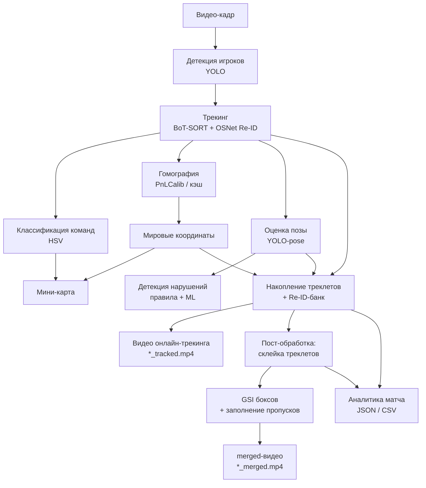

# Архитектура системы

Описание устройства кода этого репозитория: общая структура,
конвейер обработки, потоки данных, роль каждого модуля и где в коде живёт
каждый алгоритм.

> Ссылка на [дипломную работу.](https://disk.360.yandex.ru/d/Ys_AFlFnWf5VzA)

Для обзора возможностей и инструкций по установке/запуску см.
[README.md](README.md).

---

## 1. Обзор

Система построена вокруг **управляемого движка конвейера**
(`pipeline_engine.py`, класс `PipelineEngine`), который последовательно
прогоняет видео через стадии компьютерного зрения и анализа, выдавая
покадровые результаты потребителю (графическому интерфейсу или CLI).

Существует два потребителя движка:

- **`gui_app.py`** - графический интерфейс (PyQt6). Запускает движок в
  фоновом потоке, показывает живой просмотр, мини-карту, активные треки и
  аналитику, управляет экспортом.
- **`batch_process.py`** - консольный скрипт полного
  конвейера для пакетной обработки.

Отдельный CLI-скрипт **`precompute_homography.py`** заранее считает
гомографию поля и кэширует её в `homography.npz`.

---

## 2. Конвейер обработки

### Стадии

1. **Детекция** - YOLO выдаёт ограничивающие рамки игроков на кадре.
2. **Трекинг** - BoT-SORT ассоциирует детекции между кадрами, внешний
   OSNet даёт Re-ID-эмбеддинги для устойчивости при окклюзиях.
3. **Команды** - по цвету формы внутри бокса игрок относится к
   команде/вратарю/арбитру.
4. **Гомография** - пиксельные координаты переводятся в метрические
   координаты плана поля (через PnLCalib или закэшированную гомографию).
5. **Мини-карта** - мировые позиции игроков отрисовываются на схеме поля.
6. **Поза** - YOLO-pose оценивает ключевые точки скелета и сопоставляет их
   с треками.
7. **Нарушения** - правиловые детекторы и опциональный ML-классификатор
   анализируют взаимодействия поз.
8. **Накопление** - по каждому ID копятся кадры, боксы, эмбеддинги, позы и
   мировые позиции (треклеты); параллельно ведётся банк Re-ID.
9. **Пост-обработка** - фрагменты одного игрока склеиваются, боксы
   сглаживаются (GSI), пропуски детекции заполняются; рендерится merged-видео.
10. **Аналитика** - собирается сводная статистика матча.

---

## 3. Потоки данных и ключевые структуры

### `RunConfig` (`pipeline_engine.py`)
Единый датакласс конфигурации: пути к моделям/видео, пороги
детекции/IoU/высоты бокса, переключатели стадий (поза, нарушения, команды,
мини-карта, склейка, Re-ID-банк), параметры позы, нарушений, гомографии,
мини-карты, трекинга и склейки, отображаемые цвета команд.

### `FrameResult` (`pipeline_engine.py`)
Покадровый результат, который движок отдаёт потребителю: фаза
(`tracking`/`postprocess`), номер кадра, кадр для показа, изображение
мини-карты, список треков, события, статистика, текстовое сообщение.

### `Tracklet` (`tracklet_merger.py`)
Накопленная история одного ID. Параллельные списки:
`frames`, `boxes`, `embeddings`, `poses`, `world_positions`. Предоставляет
свойства/методы: длительность, стартовая/конечная позиция и скорость (в
пикселях и в мире), средний размер, среднее эмбеддинг-представление.

### `HomographyResult` (`field_homography.py`)
Результат калибровки на кадре: переводы «изображение → мир» и обратно,
проверка валидности и принадлежности точки полю.

---

## 4. Модули

### Ядро конвейера

**`pipeline_engine.py`** - класс `PipelineEngine`. Инициализирует модели и
сервисы (`_setup`), управляет жизненным циклом (`run` как генератор
`FrameResult`, плюс `request_pause/resume/stop`), накапливает треклеты и
данные кадров, запускает пост-обработку (`_run_merge`) и считает аналитику
(`compute_analytics`). Содержит также `precompute_homography_iter` -
итеративную генерацию гомографии с прогрессом (используется GUI).

### Трекинг и пост-обработка

**`tracklet_merger.py`**
- `Tracklet` - структура треклета.
- `ReIDBank` - банк эмбеддингов и мировых позиций/скоростей по трекам;
  собирает признаки (`collect`, `collect_from_frame`), ищет совпадения
  (`find_match`) и строит карту слияний (`get_merge_map`) для «воскрешения»
  потерянных ID. Поддерживает два режима: OSNet-эмбеддинги или
  гистограммы.
- `TrackletMerger.merge` - оффлайн-склейка фрагментов одного игрока.
  Строит матрицу стоимостей всех валидных пар «A предшествует B» и решает
  оптимальное паросочетание (венгерский алгоритм,
  `scipy.optimize.linear_sum_assignment`, с жадным fallback). Применяются
  гейты: временной зазор, пространственное расстояние, согласие по команде,
  мировая скорость и гейт непересечения кадров (исключает дубликаты ID в
  одном кадре). Формируются цепочки A→B→C.
- `apply_merge_to_video` - генератор, перезаписывающий видео с объединёнными
  ID и метками команд; отдаёт прогресс. Внутри - `_gsi_boxes`: сглаживание
  боксов и заполнение коротких пропусков детекции (на наблюдаемых кадрах
  рисуется сырой бокс без лага, в пропусках - интерполяция).

**`tracking_refine.py`** - численные алгоритмы уточнения (зависят только от
NumPy):
- `world_kalman_smooth` - фильтр Калмана (модель постоянной скорости) в
  мировых координатах + RTS-сглаживатель. Денойзит траекторию, оценивает
  скорость, заполняет внутренние пропуски. Применяется на почти линейном
  движении по плоскости поля.
- `gsi_smooth` - Gaussian-smoothed interpolation (гауссова регрессия с
  RBF-ядром, как GSI в StrongSORT). Сглаживает и интерполирует
  последовательности (например, координаты боксов). Данные центрируются
  перед регрессией (иначе априорное нулевое среднее GP смещает значения).

### Калибровка поля и проекция

**`field_homography.py`**
- `FieldModel` - геометрическая модель поля (ключевые точки, проверка
  принадлежности).
- `HomographyResult` - переводы координат изображение↔мир.
- `bbox_to_world_position` - позиция игрока на поле из бокса (точка опоры).
- `world_distance_meters` - метрическое расстояние между точками.
- `FieldHomographyEstimator` / `HomographyTracker` - оценка гомографии и её
  ведение по кадрам (с интерполяцией/сглаживанием между опорными кадрами).
- `CachedHomography` - загрузка/использование закэшированной гомографии из
  `homography.npz`.

**`pnlcalib_estimator.py`** - `PnLCalibHomography`: обёртка над внешним
репозиторием PnLCalib (детектор ключевых точек и линий поля → матрица
гомографии).

**`minimap.py`** - `Minimap.render` (отрисовка схемы поля и игроков по
мировым координатам), `overlay_minimap` (наложение мини-карты на кадр).

### Классификация команд

**`team_classifier.py`** - `TeamClassifier`: относит игрока к команде по
цвету формы (HSV-признаки внутри бокса, кластеризация), различает вратарей
и арбитра. Методы: `classify`, `classify_batch`, `get_team`,
`get_display_color`, `same_team`.

### Поза и нарушения

**`pose_estimator.py`** - `PoseEstimator.predict_frame` (YOLO-pose →
`PoseDetection`), `match_poses_to_tracks` (сопоставление поз с треками по
IoU), `draw_skeleton`/`draw_keypoints_only` (визуализация),
`PoseSmoother` (сглаживание ключевых точек по кадрам).

**`pose_and_fouls.py`** - `PoseAndFoulsService`: объединяет оценку
позы и детекцию нарушений за один проход по кадру (`process_frame`),
отрисовку оверлеев (`draw_overlays`, `draw_event_panel_overlay`) и
финализацию (`finalize`). Конфигурируется через `PoseFoulsConfig`.

**`interaction_detector.py`** - правиловая детекция нарушений:
- структуры `FoulSignal`, `FoulEvent`;
- правила (`rule_high_kick`, `rule_elbow_to_head`, `rule_head_butt`);
- специализированные детекторы (`SlideTackleDetector`, `ArmStrikeDetector`);
- `InteractionDetector.update` - агрегирует сигналы во временные события
  (окно/минимум срабатываний/кулдаун), отдаёт активные и все события.

**`ml_classifier.py`** - опциональная ML-ветка (LightGBM):
- `FeatureExtractor` - признаки из кандидата нарушения;
- `FoulClassifier` - загрузка модели и предсказание/применение
  (ансамблирование с правиловой оценкой, порог отклонения);
- `TrainingDataWriter` - экспорт обучающих данных.

**`foul_visualization.py`** - отрисовка визуализации нарушения и панели
событий поверх кадра.

### Графический интерфейс

**`gui_app.py`** - приложение PyQt6:
- `MainWindow` с вкладками `SetupTab` (настройки), `LiveTab` (живой
  просмотр + мини-карта + активные треки), `AnalyticsTab` (аналитика и
  экспорт);
- фоновые потоки `PipelineWorker` (прогон движка) и `HomographyWorker`
  (генерация гомографии), `DeviceProbe` (определение GPU);
- вспомогательные виджеты: `ColorButton` (выбор цвета команды), `Spinner`
  (индикатор загрузки), `TracksTree` (дерево активных треков);
- `bgr_to_pixmap` - конвертация кадра OpenCV в изображение Qt.

UI формирует `RunConfig` из выбранных настроек и запускает движок, получая
поток `FrameResult` для отображения.

---

## 5. Где какой алгоритм в коде

| Задача | Подход | Где в коде |
|--------|--------|------------|
| Детекция | YOLO (Ultralytics) | `pipeline_engine._setup` / `batch_process` |
| Ассоциация треков | BoT-SORT (движение + внешность) | `pipeline_engine` (BoxMOT `BotSort`) |
| Re-ID | OSNet-эмбеддинги + банк для воскрешения ID | `tracklet_merger.ReIDBank` |
| Склейка треклетов | Венгерский алгоритм + гейты | `tracklet_merger.TrackletMerger.merge` |
| Сглаживание траекторий | Калман (постоянная скорость) + RTS | `tracking_refine.world_kalman_smooth` |
| Интерполяция боксов | GSI (гауссова регрессия, RBF-ядро) | `tracking_refine.gsi_smooth`, `tracklet_merger._gsi_boxes` |
| Калибровка поля | Гомография (HRNet ключевые точки/линии) | `pnlcalib_estimator`, `field_homography` |
| Перевод в координаты поля | Гомография «изображение → мир» | `field_homography.bbox_to_world_position` |
| Команды | HSV-признаки формы + кластеризация | `team_classifier.TeamClassifier` |
| Поза | YOLO-pose + сглаживание ключевых точек | `pose_estimator` (`PoseEstimator`, `PoseSmoother`) |
| Нарушения | Правиловые детекторы + опциональный LightGBM | `interaction_detector`, `ml_classifier` |